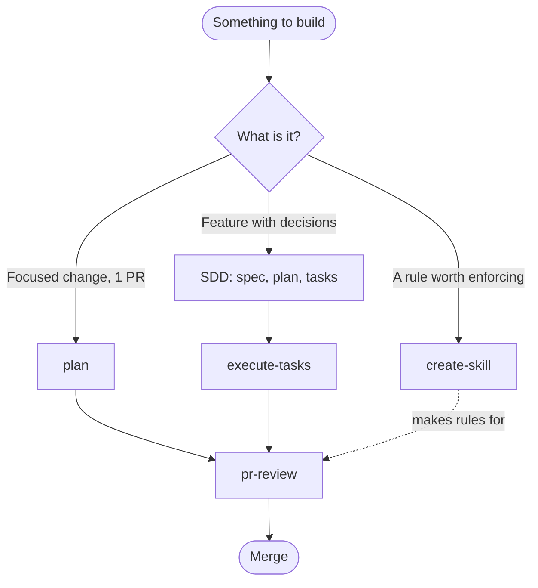
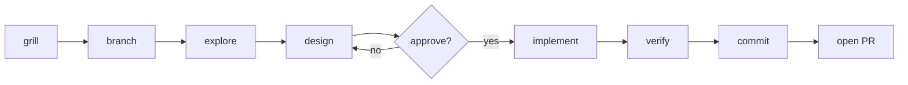
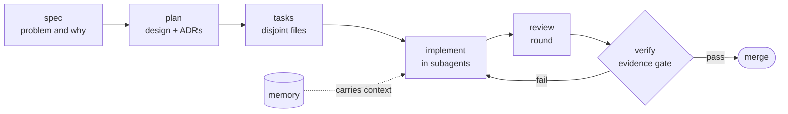
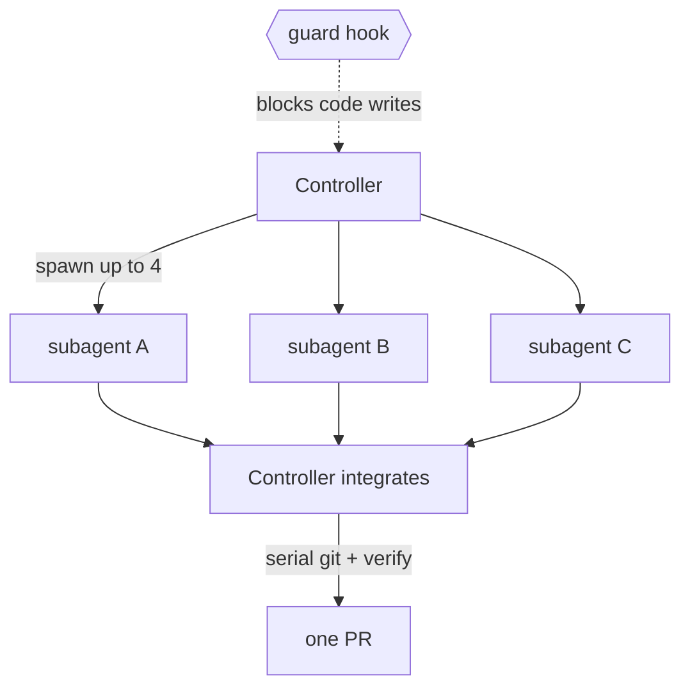

# forge

**A portable, tool-agnostic agent harness for Spec-Driven Development.**

forge is a [Copier](https://copier.readthedocs.io) template that scaffolds a new
repository already wired for AI coding agents: a canonical `AGENTS.md` contract,
a curated set of reusable **skills**, a full **spec → plan → tasks → implement**
pipeline, optional **hooks**, and **CI/CD** — all decoupled from any specific
language, framework, or vendor.

It is the distilled, genericized form of a production harness. Every
project-specific detail (stack, database, business domain) has been removed and
replaced with a **task-runner seam** and **optional integration adapters**, so
the same harness drops into a Python service, a Go CLI, or a TypeScript app.

---

## Why forge exists

AI agents are only as good as the context and guardrails you give them. Re-deriving
those for every new repo is wasteful and inconsistent. forge packages the *workflow*
— how to plan, grill assumptions, decompose, implement in parallel, review, and
verify — as portable assets that any agent can read, and that you can **evolve once
and pull everywhere** via `copier update`.

Three problems it solves:

1. **Portability across tools.** `AGENTS.md` is the cross-tool standard (read by
   Codex, Cursor, Copilot, Gemini, Aider, Zed, and 20+ others). Claude Code reads
   `CLAUDE.md` + `.claude/skills/`. forge makes `AGENTS.md` the single source of
   truth and **generates** the per-tool adapters from it.
2. **Portability across stacks.** Skills and CI never hardcode `npm` or `pytest`.
   They call **tasks** (`lint`, `test`, `build`); a `justfile` (or Make/npm) maps
   those to the real commands. Swap the stack, keep the harness.
3. **Drift.** Specs, not prose, drive the work. The SDD pipeline produces Markdown
   artifacts that feed each other, and a hard **verify** gate blocks "done" claims
   without cited evidence.

---

## The flows

forge isn't a pile of prompts — it's a **set of opinionated development workflows**,
each one an orchestrator that encodes how strong teams ship: interrogate the idea,
write the decision down, parallelize the build, review against your own rules, and
refuse to call anything "done" without proof. Every flow is stack-agnostic (it calls
**tasks**, never `npm`/`pytest`) and reads your project's rules from `AGENTS.md`, so it
works the same in any repo forge scaffolds.

| Flow | Use it when | What makes it different | How it helps you ship |
| --- | --- | --- | --- |
| **`plan`** | One focused change (1 PR) | Mandatory grilling *before* code; explore + design run as subagents | Catches the wrong assumption in chat, not in review |
| **SDD pipeline** (`sdd/*`) | A feature with real decisions | Each phase emits a Markdown artifact that feeds the next; decisions become ADRs | Turns a fuzzy ask into reviewable spec → plan → tasks; no drift |
| **`execute-tasks`** | Many tasks, one PR | True parallelism over **disjoint files**, enforced by a guard hook | Builds N tasks at once without merge chaos or lost tracking |
| **`pr-review`** | A PR to review | 5 subagents review against *your* `AGENTS.md` + domain skills | Consistent, rule-aware review without a human bottleneck |
| **`create-skill`** | A pattern worth enforcing | Generates a neutral skill + wires all adapters for you | Your codebase's rules become guardrails every agent obeys |
| **`grill-me` / `decision-making`** | Any ambiguous moment | One question at a time; recommends an answer, defers the call to you | Keeps the agent from silently guessing what you meant |

**Pick the scale explicitly** — the skills ask rather than assume. The two big
orchestrators are `plan` (single PR) and the SDD pipeline (multi-PR feature). How they
fit together:



### `plan` — the single-task flow
A focused change (one PR, a handful of files):



- **Differential:** grilling (`grill-me`) is *not optional* — the agent interviews you
  to surface hidden assumptions before a line is written, and exploration/design run as
  isolated subagents so the main thread stays clean.
- **Helps you:** the expensive mistakes (wrong scope, wrong contract) get caught in the
  conversation instead of in code review or production.

### SDD pipeline (`sdd/*`) — the feature flow
For multi-task features carrying architectural decisions. Vocabulary follows
[GitHub Spec Kit](https://github.com/github/spec-kit):



- **Differential:** each phase produces a durable Markdown artifact that feeds the
  next; non-obvious choices are recorded as ADRs; a `memory/` skill carries context
  across sessions.
- **Helps you:** large work stays legible and reviewable phase by phase — no "what was
  this feature supposed to do again?" drift halfway through.

### `execute-tasks` — parallel build
Runs many generated tasks on one branch / one PR.



- **Differential:** parallelism is by **subagents writing to disjoint files** (up to 4
  at once); the controller alone owns integration, git, tracking, and review, and a
  guard **hook** physically blocks the controller from writing code while subagents
  work. The boundary is enforced, not trusted.
- **Helps you:** features land faster without the usual cost of concurrency — no
  clobbered files, no half-tracked tasks, one clean integration PR.

### `pr-review` — rule-aware code review
A multi-subagent review (security, tests, architecture/conventions, regression,
requirements) that posts inline comments.

- **Differential:** the subagents read **your project's own rules** from `AGENTS.md`
  and your domain skills — forge ships the orchestration, you supply (or generate) the
  rules. It's assistive, never a merge gate.
- **Helps you:** every PR gets the same thorough, convention-aware pass, so review
  quality doesn't depend on who happens to be looking.

### `create-skill` — grow the harness
Interactively authors a new **domain** skill (e.g. "API route", "migration").

- **Differential:** it grills you for trigger paths and the mandatory pipeline,
  scaffolds a neutral `SKILL.md`, and wires the Claude/Copilot adapters via sync — so a
  generic forge project gains project-specific guardrails without you hand-editing three
  directories.
- **Helps you:** the lessons you'd otherwise repeat in every review become automatic
  context that every agent and every flow above respects.

---

## Core ideas

| Idea | What it means |
| --- | --- |
| **`AGENTS.md` is canonical** | One file at the repo root is the agent contract. Everything else is generated from or points back to it. |
| **Adapters, not copies** | `.claude/` and `.github/` are thin adapters. `.claude/CLAUDE.md` imports `AGENTS.md`; `.github/copilot-instructions.md` points at it. Skills live once in `.agents/skills/` and are **synced** to each tool. |
| **Task-runner seam** | Skills/CI invoke `just test`, not `npm test`. The `justfile` is the only place the real stack appears. |
| **Curated skills** | A small, high-signal set: `plan`, `grill-me`, `execute-tasks`, `decision-making`, `pr-review`, `create-skill`, and the `sdd/*` pipeline. |
| **Generate, don't fork** | `create-skill` scaffolds new **domain** skills for *your* stack; forge ships none, so there is nothing project-specific to delete. |
| **Optional integrations** | Issue tracker (Linear/GitHub) and git host are adapters chosen at scaffold time. Without them, skills degrade gracefully to local-only. |

---

## Architecture

```
your-project/
├─ AGENTS.md              ← CANONICAL contract (every agent reads this first)
├─ justfile               ← the ONLY place real stack commands live
│
├─ .agents/skills/        ← SOURCE OF TRUTH for skills (tool-neutral)
│   ├─ plan/  grill-me/  execute-tasks/  decision-making/
│   ├─ create-skill/      ← generator for new domain skills
│   ├─ pr-review/
│   └─ sdd/               ← spec → plan → tasks → implement → review → verify → memory
│
├─ .claude/               ← ADAPTER: Claude Code
│   ├─ CLAUDE.md          ← line 1: "@AGENTS.md" (import) + Claude-only extras
│   ├─ skills/            ← generated from .agents/skills/ by sync-adapters
│   ├─ agents/  hooks/    ← subagents + controller-write guard
│   └─ settings.json
│
├─ .github/               ← ADAPTER: Copilot + CI/CD
│   ├─ copilot-instructions.md   ← points at AGENTS.md
│   ├─ instructions/      ← generated redirects, one per skill
│   ├─ workflows/         ← ci.yml, pr-review.yml, agent.yml
│   └─ PULL_REQUEST_TEMPLATE.md, ISSUE_TEMPLATE/
│
└─ tools/sync-adapters.mjs   ← rebuilds the adapters from .agents/skills/
```

**The sync flow** (one source, many adapters):

```
.agents/skills/<skill>/SKILL.md   ──┬──►  .claude/skills/<skill>/SKILL.md     (verbatim copy)
        (edit here only)            └──►  .github/instructions/<skill>.md      (thin redirect)
                                    via `just sync-adapters`  (tools/sync-adapters.mjs)
```

You **only ever edit `.agents/skills/`**. Run `just sync-adapters` and the Claude
and Copilot surfaces update together. This is enforced, not a convention.

---

## Requirements

- [Copier](https://copier.readthedocs.io) ≥ 9 — `pipx install copier` (or `uv tool install copier`).
- **Node ≥ 18** — used by `tools/sync-adapters.mjs` and the optional guard hook.
- A task runner if you want `just`/`make` ergonomics (`just` recommended). `npm`
  and plain shell also work.

---

## Quick start

```bash
# Scaffold a new project (interactive prompts)
copier copy gh:nuccig/forge ./my-project
cd my-project

# Edit the justfile so the task commands match your stack, then:
just sync-adapters     # (re)generate tool adapters from .agents/skills
git init && git add -A && git commit -m "chore: scaffold from forge"
```

Open the project in your agent of choice and ask it to read `AGENTS.md`. For Claude
Code, `.claude/CLAUDE.md` imports it automatically.

### Pulling improvements later

Because forge is a Copier template, projects stay linked to it:

```bash
copier update          # merges new harness versions into your existing repo
```

Your local edits are preserved; template changes are 3-way merged. This is what
turns the harness from a one-shot starter into **living infrastructure**.

---

## The task-runner seam

This is the trick that makes one harness fit any stack. Skills and CI say *what*
to run, never *how*:

```make
# justfile  — the ONLY file that knows your stack
lint:       eslint .            # or: ruff check .   / golangci-lint run
typecheck:  tsc --noEmit        # or: mypy .         / go vet ./...
test:       vitest run          # or: pytest         / go test ./...
build:      next build          # or: python -m build
```

`AGENTS.md`, `ci.yml`, and the `verify` skill all call `just lint && just typecheck
&& just test`. Point those four recipes at a different stack and the entire harness
follows. No task runner? `make` and `npm run` work the same way; `task_runner: none`
falls back to documented shell commands.

---

## Tool compatibility

| Tool | Reads | How forge serves it |
| --- | --- | --- |
| Codex, Cursor, Gemini, Aider, Zed, … | `AGENTS.md` | Native — it's the canonical file, **always shipped** |
| Claude Code | `CLAUDE.md`, `.claude/skills/` | `CLAUDE.md` imports `AGENTS.md`; skills synced from `.agents/skills/` |
| GitHub Copilot | `.github/copilot-instructions.md`, `.github/instructions/` | Generated redirects to `AGENTS.md` + skills |

`AGENTS.md` always ships. The **per-tool adapter** (`.claude/` or the Copilot files) is
generated only for the `primary_agent` you choose at scaffold time — or for all of them
if you pick `multi`. Switch later with `copier update`; adding a brand-new tool surface
is one more adapter writer in `tools/sync-adapters.mjs`, and the source
(`.agents/skills/`) never changes.

---

## Configuration (Copier variables)

| Variable | Purpose |
| --- | --- |
| `project_name`, `project_slug`, `project_description`, `author_name` | Identity |
| `primary_agent` | Which agent this repo targets (`claude`/`codex`/`cursor`/`copilot`/`multi`) |
| `artifact_language` | Language the agent talks to humans in (skills stay English) |
| `issue_tracker`, `issue_prefix` | `linear` / `github` / `none` + branch/PR key prefix |
| `git_host` | `github` / `gitlab` / `none` |
| `task_runner` | `just` / `make` / `npm` / `none` |
| `lint_cmd`, `typecheck_cmd`, `test_cmd`, `build_cmd`, `e2e_cmd` | Real stack commands |
| `runtime_paths` | Globs that gate runtime/E2E checks in CI |
| `include_sdd`, `include_pr_review_ai`, `include_hooks` | Feature toggles |
| `license` | `MIT` / `Apache-2.0` / `proprietary` |

---

## How to evolve from the scaffold

1. **Add domain guardrails** → run `create-skill`. It scaffolds a neutral skill and
   syncs the adapters. Never hand-edit `.claude/skills/` or `.github/instructions/`
   — they are generated.
2. **Change the stack** → edit the `justfile` recipes. Nothing else moves.
3. **Improve the harness itself** → edit `.agents/skills/`, bump the version, and
   downstream projects pull it with `copier update`.
4. **Add a new tool surface** → extend `tools/sync-adapters.mjs` with a new adapter
   writer; re-run `just sync-adapters`.
5. **Tune CI** → the workflows call task-runner recipes, so they follow your
   `justfile` automatically; edit `runtime_paths` to change the E2E gate.

See [`docs/`](docs/) for deeper notes:
- [`docs/getting-started.md`](docs/getting-started.md) — first hour with a forge project.
- [`docs/architecture.md`](docs/architecture.md) — why canonical + adapters + seam.
- [`docs/authoring-skills.md`](docs/authoring-skills.md) — anatomy of a skill, by hand.

---

## Working on forge itself

forge dog-foods its own conventions — see [`AGENTS.md`](AGENTS.md) at the repo root
for how to contribute to the template. The template content lives under
[`template/`](template/); `copier.yml` defines the questions.

## License

MIT — see [`LICENSE`](LICENSE). Generated projects choose their own license at
scaffold time.
